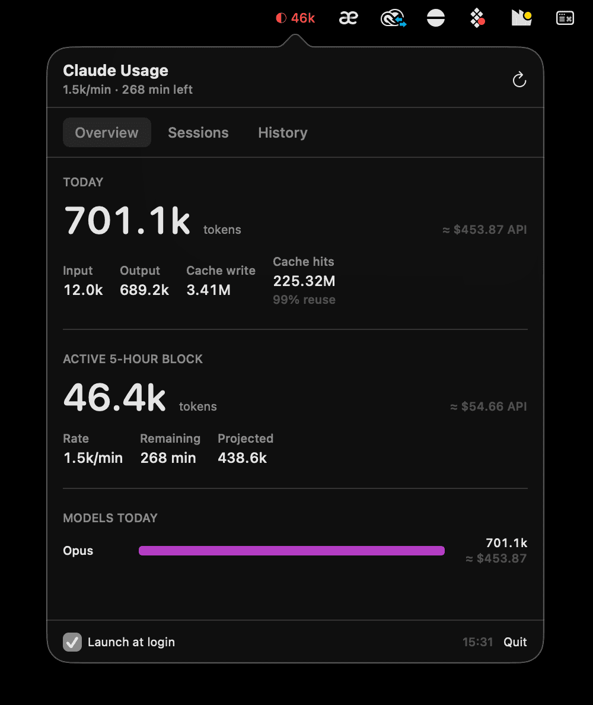
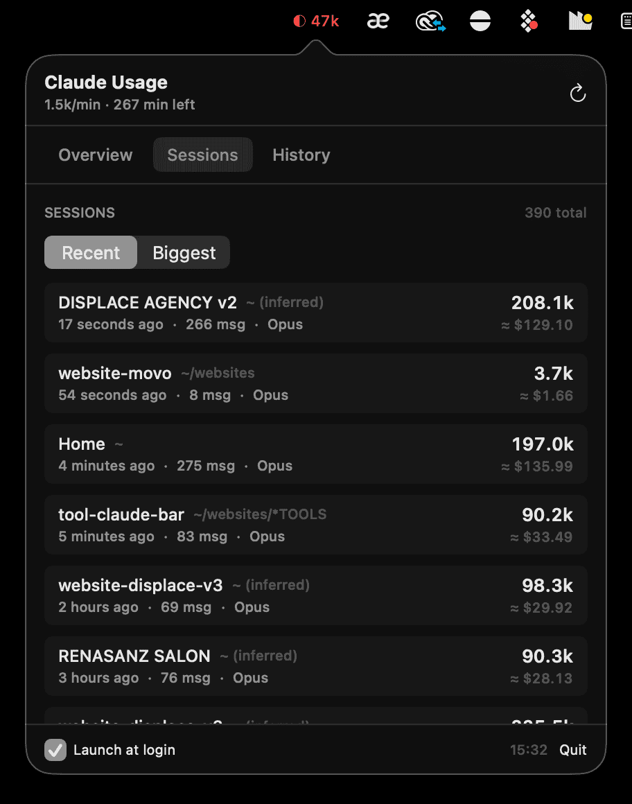
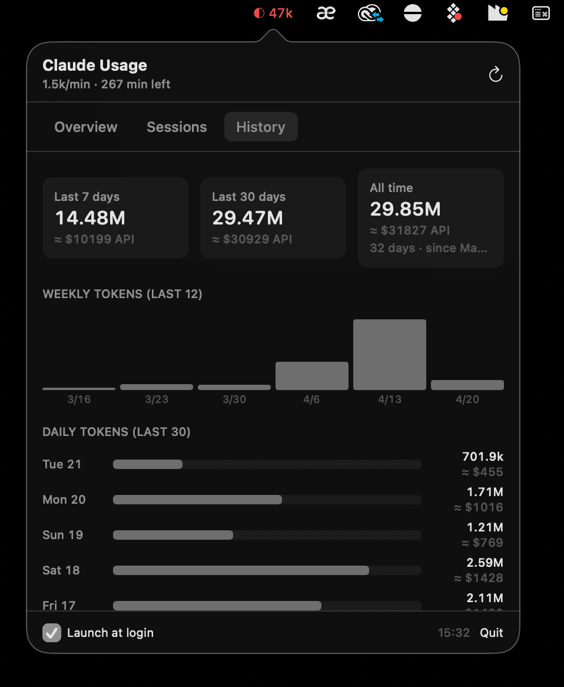

# ClaudeBar

A tiny macOS menu bar app that shows your Claude Code usage in real time. Token-first, because if you're on a subscription plan tokens are what actually matter.

<p align="center">
  
</p>

## Why it exists

`ccusage` is great from the terminal, but most of the day you don't want to open a terminal to check how close you are to filling your 5-hour block. ClaudeBar puts the number in your menu bar, tints it by burn rate, and drops a compact popover with everything you'd want.

It also reframes the dashboard around **tokens**, not dollars. On Claude Pro / Max plans the dollar figure is hypothetical — tokens are the real resource. The cost is still displayed, but as a muted `≈ $X API` hint so you can see what that usage would cost at public API rates.

## Features

- **Live 5-hour block cost + burn rate** in the menu bar (green < $5/hr, amber < $15/hr, red ≥ $15/hr)
- **Overview** — today's tokens, active block, burn rate, model breakdown (Opus / Sonnet / Haiku)
- **Sessions** — one row per conversation, grouped by project folder, sort by *Recent* or *Biggest*
- **History** — 7-day, 30-day, all-time totals + weekly bars chart + 30-day daily chart
- **Smart session naming** — even for sessions that ran from your home directory, ClaudeBar infers the project by scanning the first user messages for `/websites/<project>` or `CLIENTS/<client>` references
- **Cache hit rate** — see what % of your context is being reused from cache (higher = cheaper, more efficient)
- Launch at login, native SwiftUI, ~1.6 MB binary, no Electron

## Screenshots

| Sessions (per-project breakdown) | History (weekly + daily) |
|---|---|
|  |  |

## Install

Download the latest `ClaudeBar-x.y.z.dmg` from [Releases](../../releases), open it, drag **ClaudeBar** to `/Applications`, and launch.

First launch on an unsigned build: right-click **ClaudeBar.app** → **Open** → **Open** (macOS Gatekeeper).

## Requirements

- macOS 13 Ventura or later
- That's it. No Node.js, no external CLI, no sign-in.

## Build from source

```bash
git clone https://github.com/displace-agency/claudebar.git
cd claudebar
./scripts/build-app.sh
open build/ClaudeBar.app
```

Requires Xcode Command Line Tools (`xcode-select --install`).

## How it works

ClaudeBar parses `~/.claude/projects/**/*.jsonl` directly in Swift. These files are the raw transcripts Claude Code writes for each session; they contain every token count and model used.

On each refresh (every 60 s) the parser:

1. Walks every JSONL file under `~/.claude/projects/`
2. Caches parsed results keyed by file mtime, so unchanged files are skipped (~392 files × 100 ms cold → < 20 ms warm)
3. Streams each line, extracts `timestamp`, `model`, and `usage.{input,output,cache_creation,cache_read}_tokens`
4. Deduplicates by `(messageId, requestId)` to avoid double-counting resumed sessions
5. Aggregates into: today, active 5-hour block, per-session, per-model, per-day

**Nothing leaves your machine.** No analytics, no telemetry, no network calls.

### What counts as a "token"

`total = input + output` — the tokens Claude actually read and generated.

- `cache_creation` and `cache_read` are shown separately. Cache reads in particular are reported as "Cache hits" with a reuse percentage, because a high cache-hit rate is a *good* thing: it means you're keeping context warm and spending less per turn.
- If you prefer the other convention (input + output + cache_creation), open an issue and I'll add a toggle.

### Session naming

Sessions that ran inside a real project folder show that folder's basename. Sessions that ran from the home directory (e.g. quick one-off questions) are scanned for the first 40 lines of transcript; if they mention `/websites/<name>` or `CLIENTS/<name>` the project is inferred and marked `(inferred)`. About 80% of home-dir sessions get recovered this way.

### Cost numbers

Costs are estimates based on Anthropic's public per-million-token rates:

| Family | Input | Output | Cache write | Cache read |
|---|---|---|---|---|
| Opus 4.x | $15 | $75 | $18.75 | $1.50 |
| Sonnet 4.x | $3 | $15 | $3.75 | $0.30 |
| Haiku 4.5 | $1 | $5 | $1.25 | $0.10 |

They match `ccusage` within rounding. They do **not** reflect what you actually pay if you're on a subscription plan — they show what the same usage would cost at public API rates.

## Release

Tag a version and push — GitHub Actions builds the universal binary and attaches a DMG to the release:

```bash
git tag v0.4.0
git push --tags
```

## License

MIT
