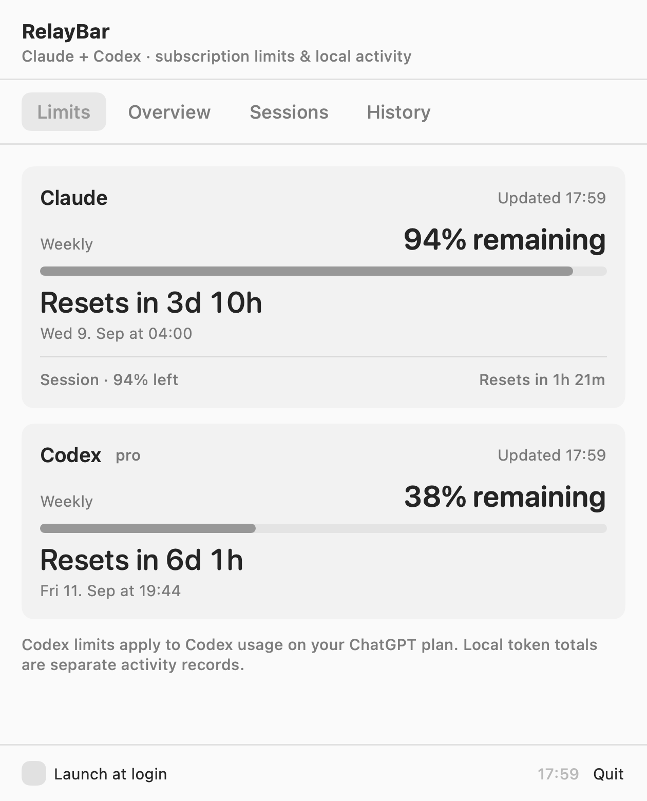
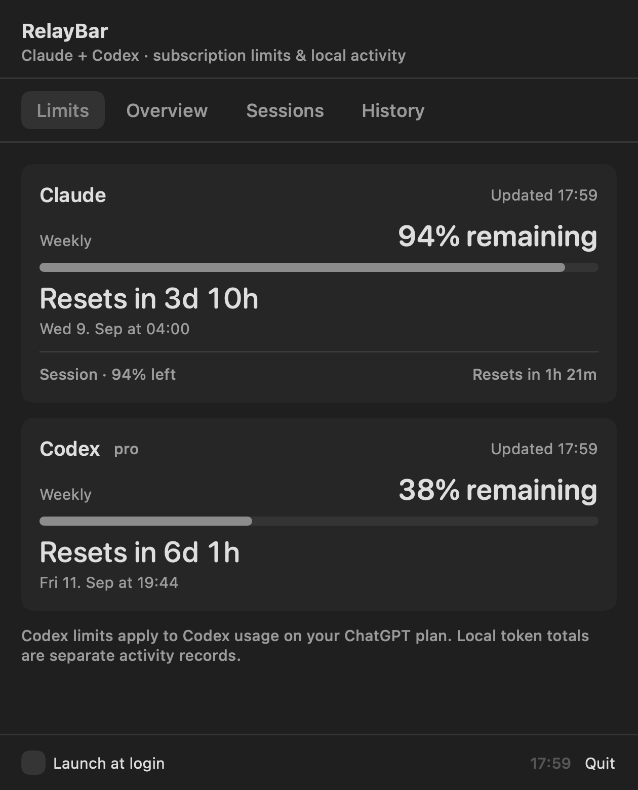
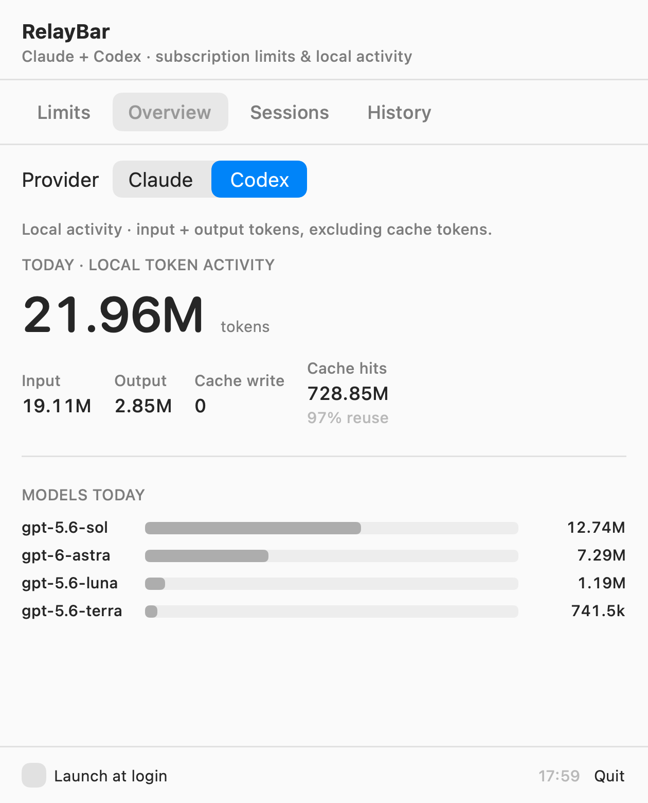

# RelayBar

**Know how much Claude and Codex you have left, and when each weekly limit resets.**

A free, open-source Mac menu bar app. Formerly ClaudeBar.

[**Download for Mac**](https://github.com/displace-agency/relaybar/releases/latest) · [Report an issue](https://github.com/displace-agency/relaybar/issues)

<p align="center">
  
</p>

## Get started

1. Download the DMG from [Releases](https://github.com/displace-agency/relaybar/releases/latest).
2. Open it and drag **RelayBar** into **Applications**.
3. Open RelayBar. Click its menu bar item to see your limits.

Requires **macOS 13 or later**, on Apple Silicon or Intel, and an existing **Claude Code and/or Codex login** on this Mac. Each provider works independently. RelayBar uses your existing subscription login; it does not require another account.

**First launch:** this community build is not Apple-notarized. If macOS blocks it, first try opening it, then use **System Settings → Privacy & Security → Open Anyway** if you trust the download. See [Apple's instructions](https://support.apple.com/en-us/102445). Do not disable Gatekeeper globally.

**Upgrading from ClaudeBar?** Quit ClaudeBar first, replace it with RelayBar, and keep one copy in Applications. The bundle identity stays the same so existing settings can carry over.

## What you can see

- **Limits:** both weekly quotas, reset countdowns, exact local reset dates, and shorter session windows when the provider reports them.
- **Menu bar:** weekly reset countdowns for Claude (`C`) and Codex (`O`). A `~` means the reading is stale.
- **Overview:** today's local token activity and model breakdown for the selected provider.
- **Sessions:** local conversations grouped by project, sorted by recent activity or size.
- **History:** calendar-based 7-day and 30-day totals, daily activity, and weekly charts.
- **Launch at login:** an optional native setting.

<p align="center">
  
  
</p>

Screenshots show real readings captured during development. Your percentages, reset dates, and available windows will differ.

## What the numbers mean

**Subscription quota and token history are different measurements.** The providers supply the quota percentages and reset timestamps. RelayBar does not estimate a subscription's allowance from token counts or assume a fixed number of tokens for a “20x” plan.

Codex's quota is for **Codex usage on your ChatGPT plan**. It is not a combined meter for every ChatGPT model, OpenAI API billing, or all activity on other devices.

Local token history comes from files on this Mac:

- Claude Code: `~/.claude/projects/`
- Codex: `~/.codex/sessions/` and `~/.codex/archived_sessions/`, or `CODEX_HOME` when set

The headline token total is new input plus output. Cache reads and cache writes are displayed separately. Codex reasoning output is not counted twice, and repeated cumulative records across resumed/archived sessions are deduplicated.

Claude's optional dollar figures are approximate API equivalents using the original app's model-family rate table, **not subscription charges or a billing reconciliation**. Codex dollar estimates are hidden.

## Privacy and reliability

- Conversation text stays on your Mac. No telemetry or analytics.
- Subscription checks make read-only HTTPS requests to Anthropic and OpenAI usage endpoints.
- Existing credentials are read into memory from Claude's Keychain entry (or its credential-file fallback) and Codex's existing `auth.json`.
- RelayBar never saves credentials, changes accounts, refreshes login tokens, or makes paid model requests.
- Quota checks run at most once per minute and back off after rate-limit responses.
- Unknown reset dates stay unknown. Failed checks show an error alongside any last-known reading and its timestamp.
- Quota checks run independently from local history scanning. A large history can take longer on first launch; unchanged files are cached in memory afterward.

Usage endpoints follow [claude-swap](https://github.com/realiti4/claude-swap) and the [Codex backend client](https://github.com/openai/codex/tree/main/codex-rs/backend-client). Provider changes can require app updates. RelayBar is an independent project and is not affiliated with Anthropic or OpenAI.

## Troubleshooting

**One provider is unavailable:** open that provider's CLI and verify you are signed in with a subscription. Wait a minute, then refresh RelayBar. API-key-only logins do not provide subscription quota.

**Credentials expired or access denied:** reconnect in Claude Code or Codex. RelayBar deliberately does not change your login. A custom CLI configuration must also be visible to the app process.

**No session window:** some accounts only return a weekly window. RelayBar shows the data the provider supplies.

**History takes time to load:** the initial scan reads existing local transcripts. Quota cards can load while that work finishes.

## Build from source

Requires Xcode Command Line Tools.

```bash
git clone https://github.com/displace-agency/relaybar.git
cd relaybar
swift test
./scripts/build-app.sh 1.0.0
```

Output: `build/RelayBar.app`, universal for Apple Silicon and Intel. The build does not install or launch it. Previous build output is preserved before replacement.

Builds use ad-hoc signing by default. Set `CODESIGN_IDENTITY` to an installed signing identity for a stable local signature. Apple notarization is not configured.

The internal Swift module remains `ClaudeBar` and the bundle identifier remains `agency.displace.ClaudeBar` for continuity.

Optional developer checks:

```bash
RELAYBAR_LIVE_USAGE_TEST=1 swift test --filter SubscriptionUsageTests
RELAYBAR_PREVIEW_DIR=/tmp/relaybar-preview swift test --filter PreviewTests
```

Live checks print sanitized quota summaries only. Fixture tests require no login or network. See [test coverage](docs/QA.md).

## Credits and license

Built by [Displace Agency](https://github.com/displace-agency).

Codex transcript schema handling is adapted from Flavio Adamo's MIT-licensed SpendBar; its license is retained in the source. Claude quota research follows realiti4's claude-swap. No account-switching dependency is installed.

[MIT License](LICENSE)
